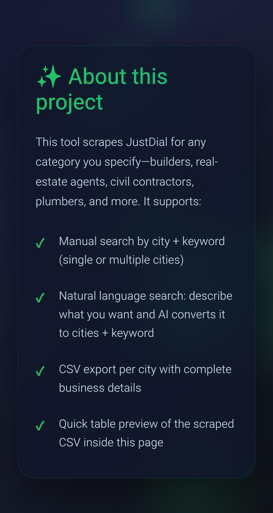
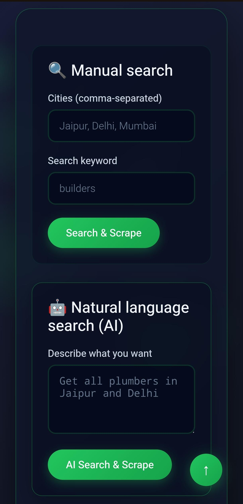
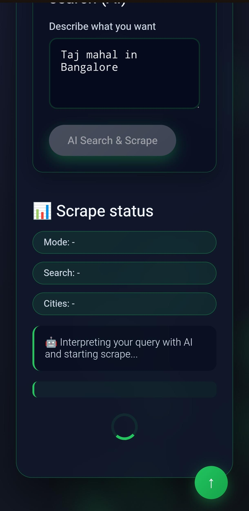
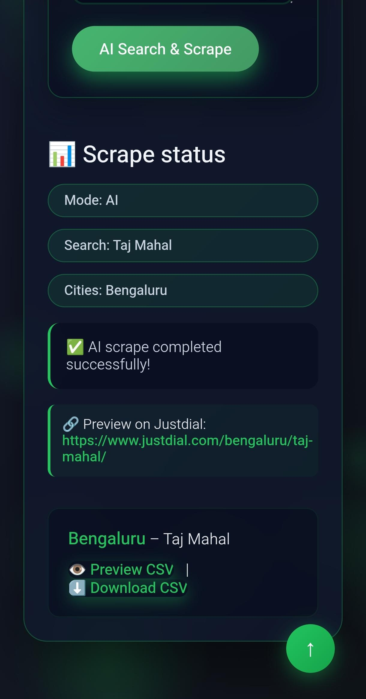
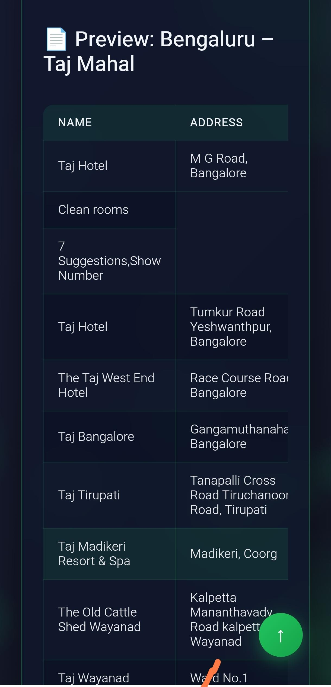

# Get-JustDial 🔍

[](https://www.python.org/downloads/)
[](https://fastapi.tiangolo.com)
[](https://opensource.org/licenses/MIT)

A powerful and intelligent JustDial web scraper that extracts business data using **natural language queries**. Simply describe what you're looking for in plain English, and the AI-powered agent will scrape the relevant data from JustDial.

---

## ✨ Features

- 🤖 **Natural Language Processing**: Ask in plain English what data you want from JustDial
  - Example: *"Get all plumbers in Jaipur and Delhi"*
  - Example: *"Find restaurants in Bangalore with home delivery and rating above 4"*
  
- 🔄 **Dual Search Modes**:
  - **Manual Search**: Specify cities and keywords directly
  - **AI-Powered Search**: Describe your needs in natural language
  
- 📊 **Data Export**: 
  - CSV files generated per city
  - Structured business information including names, addresses, phone numbers, ratings
  
- 🌐 **Web Interface**: 
  - Beautiful, modern UI with smooth animations
  - Real-time scraping status updates
  - In-browser CSV preview
  - Direct download functionality
  
- 🚀 **REST API**: 
  - FastAPI-based backend
  - Interactive API documentation (Swagger UI)
  - Easy integration with other applications

---

## 🖼️ Screenshots

**Home / Landing Page**  


**Search Options & Input**  


**Scraping in Progress**  


**Results & CSV Preview**  


**Download CSV View**  


**Additional UI View**  


## 📋 Requirements

Before you begin, ensure you have the following installed:

- **Python 3.10+** ([Download here](https://www.python.org/downloads/))
- **pip** (Python package manager - usually comes with Python)
- **Git** (for cloning the repository)
- **Internet connection** (for scraping JustDial)
- **OpenAI API Key** ([Get one here](https://platform.openai.com/api-keys))

---

## 🚀 Quick Start

### 1. Clone the Repository

```bash
git clone https://github.com/yourusername/Get-Justdial.git
cd Get-Justdial
```

### 2. Create Virtual Environment

**Linux/macOS:**
```bash
python3 -m venv venv
source venv/bin/activate
```

**Windows (PowerShell):**
```powershell
python -m venv venv
venv\Scripts\activate
```

**Windows (Command Prompt):**
```cmd
python -m venv venv
venv\Scripts\activate.bat
```

> 💡 **Tip**: You should see `(venv)` appear at the start of your terminal prompt, indicating the virtual environment is active.

### 3. Install Dependencies

```bash
pip install -r requirements.txt
```

This will install all required packages including:
- FastAPI
- Uvicorn
- OpenAI Python SDK
- BeautifulSoup4
- Requests
- And other dependencies

### 4. Set Your OpenAI API Key

The application requires an OpenAI API key to interpret natural language queries.

**Linux/macOS:**
```bash
export OPENAI_API_KEY="sk-your-actual-api-key-here"
```

**Windows (PowerShell):**
```powershell
$env:OPENAI_API_KEY="sk-your-actual-api-key-here"
```

**Windows (Command Prompt):**
```cmd
set OPENAI_API_KEY=sk-your-actual-api-key-here
```

> ⚠️ **Important**: Replace `sk-your-actual-api-key-here` with your actual OpenAI API key. Without this, you'll see the error:
> ```
> openai.OpenAIError: The api_key client option must be set either by passing api_key to the client or by setting the OPENAI_API_KEY environment variable
> ```

**Alternative: Create a `.env` file** (Recommended for persistent setup)

Create a file named `.env` in the project root:

```bash
OPENAI_API_KEY=sk-your-actual-api-key-here
```

Then install `python-dotenv` if not already installed:
```bash
pip install python-dotenv
```

### 5. Start the Server

```bash
python -m uvicorn api:app --reload
```

**Expected output:**
```
INFO:     Will watch for changes in these directories: ['/home/username/Documents/web_scrapper/Get-Justdial']
INFO:     Uvicorn running on http://127.0.0.1:8000 (Press CTRL+C to quit)
INFO:     Started reloader process [274933] using StatReload
INFO:     Started server process [277316]
INFO:     Waiting for application startup.
INFO:     Application startup complete.
```

> ✅ **Success!** Your server is now running at `http://127.0.0.1:8000`

---

## 💻 Usage

### Option 1: Web Interface (Recommended)

1. **Open your browser** and navigate to:
   ```
   http://127.0.0.1:8000
   ```

2. **Click "Get Started"** to access the scraping interface

3. **Choose your search method**:

   **Manual Search:**
   - Enter cities separated by commas: `Jaipur, Delhi, Mumbai`
   - Enter search keyword: `builders`
   - Click "Search & Scrape"

   **AI Search (Natural Language):**
   - Enter your query: `Get all plumbers in Jaipur and Delhi`
   - Click "AI Search & Scrape"

4. **View Results**:
   - See scraping status in real-time
   - Preview CSV data in your browser
   - Download CSV files for each city

### Option 2: Interactive API Documentation

1. **Open Swagger UI** at:
   ```
   http://127.0.0.1:8000/docs
   ```

2. **Available Endpoints**:

   - **`POST /scrape/manual`** - Manual search with cities and keyword
     ```json
     {
       "cities": ["Jaipur", "Delhi"],
       "search": "builders"
     }
     ```

   - **`POST /scrape/nl`** - Natural language search
     ```json
     {
       "query": "Get all plumbers in Jaipur and Delhi"
     }
     ```

   - **`GET /download`** - Download CSV file
     ```
     /download?csv_path=output/Jaipur_builders.csv
     ```

3. **Test the API**:
   - Click on an endpoint
   - Click "Try it out"
   - Enter your request data
   - Click "Execute"
   - View the response

### Option 3: cURL / Command Line

**Manual Search:**
```bash
curl -X POST "http://127.0.0.1:8000/scrape/manual" \
  -H "Content-Type: application/json" \
  -d '{
    "cities": ["Jaipur", "Delhi"],
    "search": "builders"
  }'
```

**Natural Language Search:**
```bash
curl -X POST "http://127.0.0.1:8000/scrape/nl" \
  -H "Content-Type: application/json" \
  -d '{
    "query": "Find dentists in Mumbai with rating above 4"
  }'
```

### Option 4: Python Script

```python
import requests

# Manual search
response = requests.post(
    "http://127.0.0.1:8000/scrape/manual",
    json={
        "cities": ["Jaipur", "Delhi"],
        "search": "builders"
    }
)
print(response.json())

# Natural language search
response = requests.post(
    "http://127.0.0.1:8000/scrape/nl",
    json={
        "query": "Get all plumbers in Jaipur and Delhi"
    }
)
print(response.json())
```

---

## 📁 Project Structure

```
Get-Justdial/
│
├── api.py                      # FastAPI application (main server)
├── main.py                     # Core scraping logic and utilities
├── requirements.txt            # Python dependencies
├── README.md                   # This file
│
├── public/                     # Public assets and static files
│   ├── index.html             # Web interface (front-end)
│   └── assets/
│       └── URL.txt            # JustDial base URL configuration
│
├── output/                     # Generated CSV files (created automatically)
│   ├── Jaipur_builders.csv
│   ├── Delhi_builders.csv
│   └── ...
│
└── venv/                       # Virtual environment (created by you)
```

---

## 🔧 Configuration

### JustDial URL Configuration

The scraper uses a base JustDial URL which can be configured:

1. Open `public/assets/URL.txt`
2. Update with your desired JustDial URL format
3. Default format: `https://www.justdial.com/{city}/{search}/`

### Customizing Search Parameters

You can modify scraping behavior in `main.py`:
- Number of results per page
- Data fields to extract
- Rate limiting settings
- Error handling behavior

---

## 🐛 Troubleshooting

### Common Issues and Solutions

#### 1. **OpenAI API Key Error**

**Error:**
```
openai.OpenAIError: The api_key client option must be set either by passing api_key to the client or by setting the OPENAI_API_KEY environment variable
```

**Solution:**
- Ensure you've set the `OPENAI_API_KEY` environment variable **before** starting the server
- Verify your API key is valid at [OpenAI Platform](https://platform.openai.com/api-keys)
- Check if the environment variable is set: `echo $OPENAI_API_KEY` (Linux/macOS) or `echo %OPENAI_API_KEY%` (Windows)

#### 2. **Module Not Found Error**

**Error:**
```
ModuleNotFoundError: No module named 'fastapi'
```

**Solution:**
- Ensure your virtual environment is activated (you should see `(venv)`)
- Run `pip install -r requirements.txt` again
- If still failing, try: `pip install --upgrade pip` then reinstall dependencies

#### 3. **Port Already in Use**

**Error:**
```
OSError: [Errno 48] Address already in use
```

**Solution:**
- Another process is using port 8000
- Option 1: Kill the existing process
  - Linux/macOS: `lsof -ti:8000 | xargs kill -9`
  - Windows: `netstat -ano | findstr :8000` then `taskkill /PID <PID> /F`
- Option 2: Use a different port
  ```bash
  python -m uvicorn api:app --reload --port 8001
  ```

#### 4. **Scraping Returns No Data**

**Possible Causes:**
- JustDial website structure has changed
- Network connectivity issues
- Rate limiting by JustDial
- Invalid search terms or city names

**Solution:**
- Check your internet connection
- Verify the city name is correct
- Try different search keywords
- Check `public/assets/URL.txt` for correct URL format

#### 5. **CSV Download Not Working**

**Solution:**
- Check that the `output/` directory exists
- Verify file permissions
- Ensure scraping completed successfully before downloading

---

## 📊 Example Queries

Here are some example natural language queries you can try:

1. **Basic searches:**
   - "Get all plumbers in Jaipur"
   - "Find restaurants in Bangalore"
   - "List builders in Delhi and Mumbai"

2. **Multi-city searches:**
   - "Get plumbers in Jaipur, Delhi, and Mumbai"
   - "Find dentists across Pune, Hyderabad, and Chennai"

3. **Category searches:**
   - "Get real estate agents in Noida"
   - "Find civil contractors in Ahmedabad"
   - "List electrical contractors in Kolkata"

4. **Combined searches:**
   - "Get all home service providers in Jaipur"
   - "Find construction companies in multiple cities"

---

## 🛡️ Best Practices

1. **Rate Limiting**: Don't scrape too aggressively. Be respectful of JustDial's servers.

2. **Data Usage**: Use scraped data responsibly and in compliance with JustDial's terms of service.

3. **API Key Security**: 
   - Never commit your OpenAI API key to version control
   - Use environment variables or `.env` files
   - Add `.env` to `.gitignore`

4. **Error Handling**: Monitor logs for errors and handle them gracefully in production.

5. **Virtual Environment**: Always use a virtual environment to avoid dependency conflicts.

---

## 📝 API Response Format

### Successful Response

```json
{
  "search": "builders",
  "cities": ["Jaipur", "Delhi"],
  "results": [
    {
      "city": "Jaipur",
      "csv_path": "output/Jaipur_builders.csv",
      "count": 50
    },
    {
      "city": "Delhi",
      "csv_path": "output/Delhi_builders.csv",
      "count": 75
    }
  ]
}
```

### CSV File Format

Each CSV contains the following columns:
- Business Name
- Address
- Phone Number
- Rating
- Reviews Count
- Category
- Website (if available)
- Additional Info

---

## 🔒 Security Notes

- **API Key Protection**: Never expose your OpenAI API key in client-side code
- **Environment Variables**: Use `.env` files for sensitive configuration (don't commit them!)
- **Input Validation**: The API validates all inputs to prevent injection attacks
- **Rate Limiting**: Consider implementing rate limiting for production deployments

---

## 🤝 Contributing

Contributions are welcome! Here's how you can help:

1. Fork the repository
2. Create a feature branch (`git checkout -b feature/AmazingFeature`)
3. Commit your changes (`git commit -m 'Add some AmazingFeature'`)
4. Push to the branch (`git push origin feature/AmazingFeature`)
5. Open a Pull Request

---

## 📄 License

This project is licensed under the MIT License - see the LICENSE file for details.

---

## 🙏 Acknowledgments

- [JustDial](https://www.justdial.com) for providing the business directory data
- [FastAPI](https://fastapi.tiangolo.com) for the excellent web framework
- [OpenAI](https://openai.com) for the natural language processing capabilities
- All contributors who have helped improve this project

---

## 📧 Support

If you encounter any issues or have questions:

1. Check the [Troubleshooting](#-troubleshooting) section
2. Search existing [GitHub Issues](https://github.com/yourusername/Get-Justdial/issues)
3. Create a new issue with:
   - Your Python version
   - Operating system
   - Error messages (full traceback)
   - Steps to reproduce

---

## 🗺️ Roadmap

Future enhancements planned:

- [ ] Add support for more filters (ratings, reviews, verified businesses)
- [ ] Implement caching to speed up repeated searches
- [ ] Add export formats (JSON, Excel, Database)
- [ ] Create Docker container for easy deployment
- [ ] Add user authentication for API access
- [ ] Implement scheduled scraping jobs
- [ ] Add data visualization dashboard

---

## ⚖️ Disclaimer

This tool is for educational and research purposes only. Users are responsible for complying with JustDial's Terms of Service and robots.txt. The developers of this tool are not responsible for any misuse or violations of terms of service.

---

**Made with ❤️ by the Get-JustDial Team**

*Last updated: February 2026*